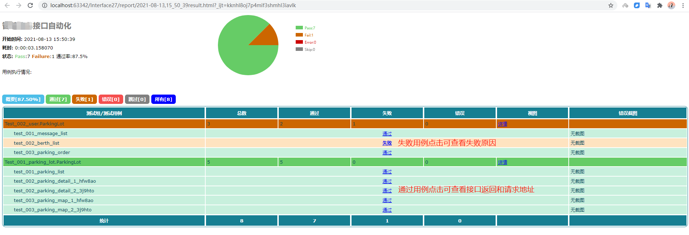
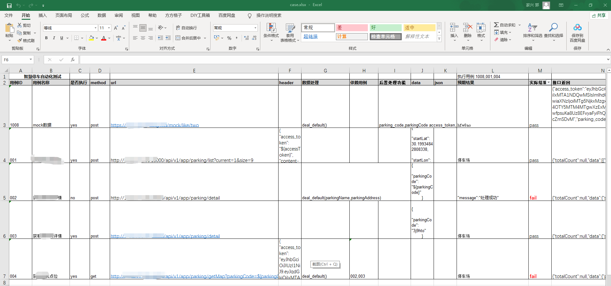

# **python接口自动化测试工具**


项目包含两套接口自动化测试工具，可分别独立运行。一套为requests+unittest，一套为关键字驱动。


## python+requests+unnitest
```python
params = {
            "token": globalvar.get_value('token'),
            "random": random.randint(0, 99999999),
        }
        url = self.url + 'XXXXX'
        r = requests.post(url, data=params)

        self.assertEqual(r.status_code, 200)
```
利用requests库做接口请求，unittest框架整合运行测试用例。依赖数据存放在一个全局的字典中。

测试报告




## 关键字驱动接口自动化测试



特点：

- 低成本 无需额外代码也可以进行基础测试工作

- 可扩展 可根据业务需要进行功能扩展

- 易维护 数据维护在excel表格中，方便修改

  

*接口请求*：excel表格中一行为一条用例，填写接口的基础信息。

*执行顺序*：

1. 若右上角‘执行用例’处无数据，则按表格顺序执行，是否执行列可控制此用例是否执行。

2. ‘执行用例’处有数据则按此处填写用例顺序执行。

   对于上述2种情况在执行时都会判断此用例是否存在依赖用例，如果存在依赖用例则会先强制执行依赖用例

*数据处理*：已默认提供了一种数据处理方法 deal_default(),将接口返回的全部或指定数据保存供被依赖用例使用
此处可以根据需要自定义方法进行扩展。

*依赖处理*：依赖与上个用例的数据可通过${var}格式的变量获取，支持在请求头、请求体和请求地址中使用

*结果断言*：默认断言为http状态码等于200且预期结果字符串在接口返回中

*结果回填*：运行成功后会回填表格中的实际结果和接口返回列，接口返回数据可以辅助定位问题
